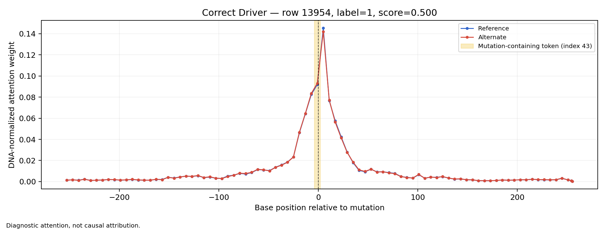
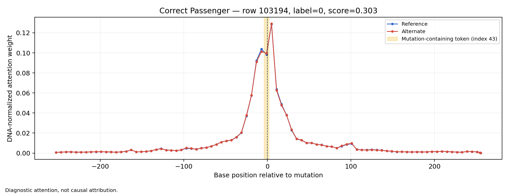

# genomic-variant-prioritizer

A reproducible pipeline that fine-tunes a genomic language model (Nucleotide Transformer) to predict whether somatic breast cancer mutations are functionally impactful ("driver-like") or not, and outputs a ranked, batch-scored report from a VCF input file.

> **⚠️ Genome build: GRCh38.** All coordinates, reference sequences, and inputs to this tool assume GRCh38. The source TCGA-BRCA mutation data is distributed in **GRCh37** coordinates and was lifted over to GRCh38 as part of this pipeline (see [Liftover](#grch37--grch38-liftover) below). If you supply your own VCF, it must use GRCh38 coordinates.

---

## What this does

Every sequenced cancer genome turns up thousands of somatic mutations, but only a small fraction are biologically meaningful ("driver" mutations that contribute to cancer progression) — the rest are inert "passenger" mutations. This tool:

1. Takes a cohort's somatic mutation calls (VCF) as input
2. Extracts DNA sequence context around each variant
3. Uses a fine-tuned genomic language model to predict functional impact
4. Outputs a ranked report a researcher can use to prioritize follow-up

This is a **fine-tuning + productionization** project, not a from-scratch model architecture project. The emphasis is on doing the full pipeline — data handling, fine-tuning, evaluation, packaging, reproducibility — rigorously and honestly, rather than maximizing a benchmark number.

---

## Scope (v1)

- **Variant types:** SNVs only. Indels are out of scope (they shift sequence length and complicate windowed extraction).
- **Cohort:** TCGA-BRCA (breast cancer), the `brca_tcga_pan_can_atlas_2018` study via cBioPortal.
- **Labels:** Driver vs. passenger, using COSMIC Cancer Gene Census (CGC) gene membership as a weak/proxy label — this is a real limitation, discussed below.
- **Model:** Nucleotide Transformer v2, 50M-parameter variant (`InstaDeepAI/nucleotide-transformer-v2-50m-multi-species`).
- **Genome build:** GRCh38 for all processed coordinates and model inputs.

---

## Data sourcing

You need to supply three data sources yourself — none are bundled in this repo (see [Licensing](#license) below).

**1. TCGA-BRCA mutation data.** Public, open access, via cBioPortal's DataHub. The legacy raw S3 archive URL returned HTTP 403 during this project, so the working retrieval path used DataHub's Git LFS backend. Install Git LFS, then fetch only the required file:

```bash
git lfs install --skip-repo --skip-smudge
git clone --depth 1 --filter=blob:none --sparse https://github.com/cBioPortal/datahub.git
cd datahub
git sparse-checkout set public/brca_tcga_pan_can_atlas_2018
git lfs install --local --skip-smudge
git -c lfs.fetchexclude="" lfs pull \
  -I public/brca_tcga_pan_can_atlas_2018/data_mutations.txt

shasum -a 256 public/brca_tcga_pan_can_atlas_2018/data_mutations.txt
```

The verified Git LFS object is 136,503,542 bytes with SHA-256:

```text
9cb009b18e3ea2efbd7ae124c7a78490135e9a9e4288b1a5ee904f5546fa7d02
```

This digest matches the object ID in cBioPortal DataHub's official Git LFS pointer. Copy the resulting file to the `source_maf` path configured in `config/config.yaml`.

**2. GRCh38 reference FASTA.** Only the chromosomes actually represented in your variant data are needed — download per-chromosome from UCSC or Ensembl, not the whole genome. This repo's dataset spans chromosomes 1–22, X, and Y.

**3. COSMIC Cancer Gene Census.** Requires a free academic COSMIC account. Register at cancer.sanger.ac.uk/cosmic, download the Cancer Gene Census CSV export, and place it locally per the licensing note below. **This file must never be committed to a fork of this repo.**

**Data use agreement note:** TCGA/cBioPortal data carries a data use agreement even at the public tier. You are responsible for sourcing your own copy under those terms — this repo does not redistribute a derived dataset.

---

## GRCh37 → GRCh38 liftover

The TCGA-BRCA MAF data is distributed in **GRCh37** coordinates, not GRCh38. This was caught early by an automated build check (confirming the reference base at each variant's position matched the MAF's listed reference allele) rather than discovered downstream — a mismatch here would silently train the model on the wrong sequence context with no error.

An auditable liftover utility (`scripts/liftover_maf_snvs.py`) handles the conversion:

- Uses the official UCSC `hg19ToHg38.over.chain.gz`
- Correctly converts between MAF's 1-based and pyliftover's 0-based coordinates
- Scoped to SNVs only (this project's v1 scope)
- Rejects ambiguous mappings (more than one candidate target location), unmapped coordinates, and mappings to alternate/random contigs — explicitly, with reasons, not silently
- Correctly complements alleles for reverse-strand chain mappings (455 records in this dataset)
- Preserves rejected records in a separate audit file

**Validation:** 16 collected unit-test cases cover this script, including two tests cross-checked against an **independent** source — Ensembl's own coordinate mapping tool — not just internal consistency with the UCSC chain file the script itself uses. This matters because a shared misunderstanding of the chain file format could otherwise pass both the script and a test built on the same source.

**Results on the SHA-verified full dataset:**

- Input: 126,252 original MAF records
- Successfully lifted to GRCh38 SNVs: 113,526
- Non-SNV records excluded: 12,657
- Alternate/random-contig mappings rejected: 57
- Unmapped: 12

---

## Data pipeline & sanity checks

Per variant, a 512 bp reference sequence window is extracted (variant centered at index 256), and an alternate window is constructed by substituting the alt allele at the center position.

**Mandatory reference-allele concordance check** (the single most important check in the pipeline — it validates both the genome build and the liftover step itself): for every variant, the extracted reference base is compared against the MAF's listed reference allele.

- Overall concordance: 113,525 / 113,526 (99.9991%)
- Forward-chain subset: 113,070 / 113,071 (99.9991%)
- Reverse-chain subset: 455 / 455 (**100%**)
- The single mismatch was investigated and found to be a genuine reference-allele change between genome assembly versions at that position, not a pipeline error, and was excluded.

The 100% concordance on the reverse-chain subset specifically confirms the liftover's allele-complementation logic held up on the full real dataset, not just the synthetic test cases.

**Labeling:** COSMIC CGC gene membership, restricted to this single cancer cohort (tissue-specific driver effects mean a blanket multi-cancer-type label would be unreliable — see Limitations).

**Class balance:** 8,387 driver-labeled variants (7.39%) / 105,138 passenger-labeled variants (92.61%) out of 113,525 final labeled variants — a significant imbalance, handled throughout via class-weighted loss and AUPRC-based evaluation rather than accuracy.

**Train/validation/test split** (`gene-split-v1`, seed 42): split at the **gene level** — every variant from a given gene is entirely within one split, never divided across splits, to prevent the model from learning "this gene = driver" as a shortcut rather than learning real sequence signal.

| Split | Variants | Genes | Drivers | Passengers |
|---|---:|---:|---:|---:|
| Train | 91,308 | 14,977 | 6,829 | 84,479 |
| Validation | 10,861 | 1,872 | 784 | 10,077 |
| Test | 11,356 | 1,872 | 774 | 10,582 |

Gene overlap between splits: **zero**.

**Patient overlap:** 100% of test-set variants come from patients who also appear in the training set. This is a structural property of the cohort, not a pipeline flaw: the gene-patient graph is one fully connected component spanning all 1,009 patients and 18,721 genes (a handful of frequently mutated genes like TP53 link nearly the entire cohort together), so enforcing patient-disjoint splits alongside gene-disjoint splits would require discarding the large majority of the dataset. This is not treated as direct patient-identity leakage for this model specifically, because the model's only input is DNA sequence context around a variant — it has no patient ID or patient-level covariate as a feature — but it remains a cohort-dependence limitation.

---

## Baseline model

A class-weighted logistic regression trained on hand-crafted sequence features, used as the number the fine-tuned model needs to beat:

- Reference/alternate window GC content, GC-content delta
- One-hot encoded reference and alternate allele
- Reference trinucleotide context centered on the variant
- Transition indicator (A↔G or C↔T)
- CpG-context indicator

COSMIC CGC membership was deliberately **excluded** from this feature set — since CGC membership is the label source itself, including it would make the "baseline" trivially reconstruct the label (confirmed via a separate circularity diagnostic run, which unsurprisingly scored AUPRC 1.0 and was excluded from consideration as a real baseline).

| | Validation AUPRC | Test AUPRC |
|---|---:|---:|
| Prevalence (chance) | 0.0722 | 0.0682 |
| Baseline (logistic regression) | 0.0873 | 0.0753 |

A random forest was also trained for comparison and underperformed logistic regression on both splits, plausibly because the feature set is small and low-signal enough that a simpler model generalizes better.

---

## Fine-tuned model

**Architecture:** `InstaDeepAI/nucleotide-transformer-v2-50m-multi-species`, fully fine-tuned for 3 epochs with class-weighted cross-entropy loss. Reference and alternate sequences are encoded separately with a shared encoder; the contextual embedding at the mutation-containing token is taken from each, along with their directional difference (alt − ref), concatenated and passed through a small MLP classification head. This mutation-token approach (rather than mean-pooling the full window) was chosen because the ref/alt difference affects only one token, and whole-window pooling risked diluting that signal.

**Tokenizer check (verified before trusting any results):** the model tokenizes DNA in 6-mers, not single bases — meaning the variant position does not necessarily fall on a token boundary. Verified on 100 real variants: every ref/alt pair produced identically-length (88-token) sequences with matching boundary alignment; the variant consistently fell at offset 4 within token index 43 (covering sequence positions 252–258). No length or boundary mismatch was found between ref/alt pairs.

**Result:**

| | Validation AUPRC | Test AUPRC |
|---|---:|---:|
| Baseline | 0.0873 | 0.0753 |
| Fine-tuned | 0.0906 | 0.0860 |

**Statistical significance (paired, class-stratified bootstrap, 10,000 iterations, 95% CI):**

- Validation: difference +0.0033, 95% CI **[-0.0071, 0.0128]** — crosses zero, **not statistically confirmed**.
- Test: difference +0.0107, 95% CI **[0.00066, 0.0226]** — excludes zero, but the lower bound sits very close to it. This should be read as a **modest, marginally significant** improvement, not a strong or unequivocal one.

**Honest summary:** the fine-tuned model outperforms the baseline directionally on both splits, with statistical support on the test set specifically, though that support is not strong. The result should not be described as a large or definitively established improvement — it is a real but modest signal, consistent with the label source (gene-level CGC membership) being a noisy proxy for true per-variant functional impact.

---

## Calibration

The model's raw output probabilities are **not well calibrated** and should not be read as literal confidence. On the test set:

| Statistic | Value |
|---|---:|
| Minimum | 0.303 |
| Mean | 0.413 |
| Median | 0.407 |
| Maximum | 0.967 |
| True prevalence | 6.8% |

Predicted probabilities are compressed into a narrow band well above the true prevalence — a known side effect of class-weighted training, which corrects ranking behavior without preserving a calibrated probability scale. This is why the CLI (below) does not present raw probabilities as "confidence."

---

## Batch scoring CLI

```bash
variant-prioritizer score \
  --input cohort.vcf \
  --output report/ \
  --reference-dir data/raw/reference \
  --cosmic data/raw/cosmic/cancer_gene_census.csv \
  --checkpoint path/to/best_model.pt \
  --batch-size 32 \
  --device cpu
```

The five path arguments are required. `--batch-size` is optional and defaults to `32`. `--device` is optional and accepts `cpu` or `cuda`; when omitted, the scorer selects CUDA if available and otherwise CPU.

**Output (`report/ranked_variants.csv`):** `Priority_Rank`, `Mutation`, `Affected_Gene`, `Predicted_Impact` (labeled `relative_driver_likeness`, not a clinical claim), `Ranking_Score_Uncalibrated`, `Priority_Tier`, `Known_Cancer_Association`.

Given the calibration finding above, raw model output is deliberately **not** exposed as "confidence." Instead:

- `Ranking_Score_Uncalibrated` is explicitly labeled as suitable for relative ordering only.
- `Priority_Tier` provides cohort-relative percentile bands (`top_5_percent`, `top_20_percent`, `remaining`) computed within the submitted cohort — a more defensible presentation than treating the compressed 0.30–0.97 raw range as literal probability. These tiers become less meaningful on very small input cohorts, since percentile bands need a reasonably sized sample to mean much.

Also produced: `report/rejected_variants.csv` (with explicit rejection reasons) and `report/run_metadata.json` (including the exact SHA-256 of the model checkpoint used, so every report is traceable to the specific trained model that produced it).

**Real-world VCF handling:** uses `pysam`, not a hand-rolled parser. Handles multi-allelic sites (expanded into one scored row per alternate allele), missing genotype fields (site-only VCFs are accepted, since genotype data is not required for scoring), and `chr1` vs. `1` chromosome-naming inconsistencies. Malformed input produces a clear error message, not a crash — verified with deliberately malformed test VCFs.

---

## Reproducibility

- **Docker:** a digest-pinned image (`Dockerfile`) runs the CLI end to end with pinned dependencies matching `environment.yml`. No data, reference FASTA, COSMIC file, or model checkpoint is bundled in the image — these are mounted by the user at runtime.
- **Verified cross-environment inference:** the approved checkpoint was run against the 8 representative Phase 8 test variants using the archived Phase 5 probabilities and the rebuilt pinned Docker image. Scores matched to floating-point noise (maximum absolute difference: 1.49 × 10⁻⁷), confirming that the packaged model code reproduces the validated inference values rather than merely starting successfully.
- **Model checkpoint versioning:** every CLI run computes and logs the SHA-256 digest of the checkpoint used, so any report can be traced to the exact model that produced it. The approved Phase 4 checkpoint used for Phase 8 has SHA-256 `a221f21ee105c4d5ec956236a0fe26cd044ff7a83031157e008b3de260ec6442`, recorded in `reports/phase8/phase8_report.json`.
- **Experiment tracking:** Phase 3 baseline training and Phase 4 fine-tuning were logged via MLflow; their durable run IDs and key metrics are preserved in committed JSON reports. The local `mlruns/` directory is intentionally gitignored and is not the source of truth.

---

## Interpretability

As a diagnostic addition, final-layer attention weights from the fine-tuned model were extracted and visualized for a sample of test-set predictions, examining which regions of the 512 bp window the model attends to most strongly from the mutation-containing query token (index 43, covering sequence positions 252–258).

Visualizations cover 8 representative examples — 3 correctly classified drivers, 3 correctly classified passengers, and 2 false positives (included deliberately, not just successes) — available in `reports/phase8/`.





**Important caveat:** this is included as a diagnostic aid only, not a definitive causal explanation. Sequence attribution for genomic transformer models is a genuinely unsettled area of research — attention weights show what the model attended to during inference, not necessarily what biologically or causally drove the prediction. Read these as a starting point for qualitative inspection, not validated biological insight. See [`reports/phase8/README.md`](reports/phase8/README.md) for the method, all plots, underlying attention data, and the complete limitation statement.

---

## Model improvement exploration (not completed)

A model/training improvement track was scoped to explore whether performance could be pushed further while holding the dataset, labels, and split fixed: scaling to larger Nucleotide Transformer variants (100M/250M), hyperparameter tuning with early stopping on validation AUPRC, a pooling architecture ablation (mutation-token vs. mean-pooling vs. learned attention-pooling), integrating conservation scores (phyloP/phastCons) as an auxiliary feature, and reverse-complement sequence augmentation.

The supporting code and unit tests were implemented and validated (`src/models/phase9.py`, `tests/test_phase9.py`), but the experiments were not run to completion due to time constraints. **No results from this exploration are reported or used anywhere in this document** — all performance numbers above are the original, fully validated results.

A label-quality upgrade — replacing gene-level COSMIC CGC membership with mutation-level annotations (for example, OncoKB or Cancer Hotspots) — is identified as the most promising direction for a future v2, since it directly targets the likely ceiling on current performance: a gene-level label cannot distinguish a true oncogenic hotspot mutation from a near-neutral passenger mutation elsewhere in the same driver gene.

---

## Limitations

- **Label quality:** COSMIC CGC gene membership is a weak, gene-level proxy for driver status, not a per-variant ground truth. This is likely the dominant ceiling on model performance.
- **Single cancer type:** trained and evaluated on TCGA-BRCA only; driver effects are often tissue-specific, so this model should not be assumed to generalize to other cancer types.
- **SNVs only:** indels are out of scope for v1.
- **Small effective label size:** 8,387 driver-labeled variants — a deliberate, disclosed scope choice (per Section 2 of the project spec), not an oversight.
- **Patient overlap:** see the data pipeline section above — structurally total in the test set, but not direct patient-identity leakage for this sequence-only architecture.
- **Uncalibrated outputs:** raw model probabilities are compressed and systematically elevated relative to true prevalence; use `Ranking_Score_Uncalibrated` for relative ordering and `Priority_Tier` for cohort-relative context, not as calibrated confidence.
- **Small-cohort tier instability:** `Priority_Tier` percentiles are less meaningful on very small input VCFs.
- **No external validation against an established tool:** an optional comparison against CADD scores was scoped but not completed because matching local CADD scores were unavailable.
- **Interpretability caveat:** see the Interpretability section above — attention visualization is diagnostic only, not causal explanation.

---

## Repository structure

```text
.
├── Dockerfile
├── LICENSE
├── README.md
├── Snakefile
├── environment.yml
├── pyproject.toml
├── requirements-docker.txt
├── variant-effect-predictor-spec.md
├── config/
│   └── config.yaml
├── scripts/
│   ├── check_hf_access.py
│   └── liftover_maf_snvs.py
├── src/
│   ├── cli/                    # VCF parsing, scoring, and report generation
│   ├── evaluation/             # Phase 5 bootstrap and Phase 8 diagnostics
│   ├── models/                 # baseline, approved LM, prediction, Phase 9 scaffolding
│   └── pipeline/               # parsing, sequence extraction, labels, split, validation
├── tests/                      # 65 passing tests plus 2 environment-dependent skips
├── notebooks/
│   ├── phase4_colab.ipynb
│   └── phase9_model_scale_colab.ipynb
└── reports/
    ├── phase2/
    ├── phase3_baseline_report.json
    ├── phase4_report.json
    ├── phase5/
    ├── phase6/
    ├── phase7/
    └── phase8/
```

This extends the original specification's suggested layout with dedicated `scripts/`, `evaluation/`, and committed aggregate `reports/` directories. User data, checkpoints, MLflow storage, and run-specific outputs remain ignored.

## Local setup (Conda)

The verified local setup uses the pinned `variantfx` Conda environment and installs this repository's CLI entry point in editable mode:

```bash
git clone https://github.com/djasleen15/genomic-variant-prioritizer.git
cd genomic-variant-prioritizer

conda env create -f environment.yml
conda activate variantfx
python -m pip install --no-build-isolation --no-deps -e .

# Verify pretrained-model access and one forward pass.
python scripts/check_hf_access.py

# Verify the installed CLI and run the tests.
variant-prioritizer score --help
python -m pytest -q
```

The Hugging Face check downloads and caches `InstaDeepAI/nucleotide-transformer-v2-50m-multi-species` on first use, tokenizes a dummy DNA sequence, and performs a forward pass. The current full test result is **65 passed, 2 skipped**.

## Docker quickstart

Build the digest-pinned CPU image from the repository root:

```bash
docker build -t genomic-variant-prioritizer:0.1.0 .
```

Place the user-supplied GRCh38 VCF, reference FASTAs, COSMIC CGC file, and approved checkpoint under one host directory. The image contains none of these artifacts.

```text
run/
├── cohort.grch38.vcf
├── cancer_gene_census.csv
├── best_model.pt
├── reference/
│   ├── chr1.fa
│   └── ...
└── report/
```

Run the CLI with that directory mounted at `/work`:

```bash
mkdir -p run/report

docker run --rm \
  -v "$PWD/run:/work" \
  genomic-variant-prioritizer:0.1.0 \
  score \
  --input /work/cohort.grch38.vcf \
  --output /work/report \
  --reference-dir /work/reference \
  --cosmic /work/cancer_gene_census.csv \
  --checkpoint /work/best_model.pt \
  --batch-size 32 \
  --device cpu
```

The output remains on the host in `run/report/`. The first model invocation requires network access to Hugging Face unless its cache is mounted separately. The pinned image was rebuilt successfully from the current repository state.

## License

Code is licensed under MIT (see [`LICENSE`](LICENSE)). This license covers code only — it does not extend to any third-party data (TCGA, COSMIC), pretrained model files, genome references, or the trained model checkpoint, which carry their own separate usage terms as described above.
